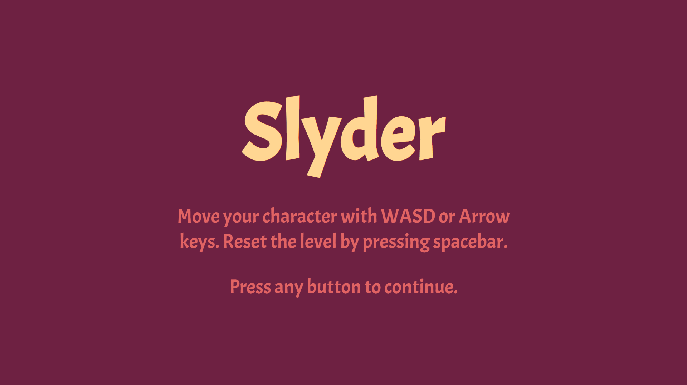
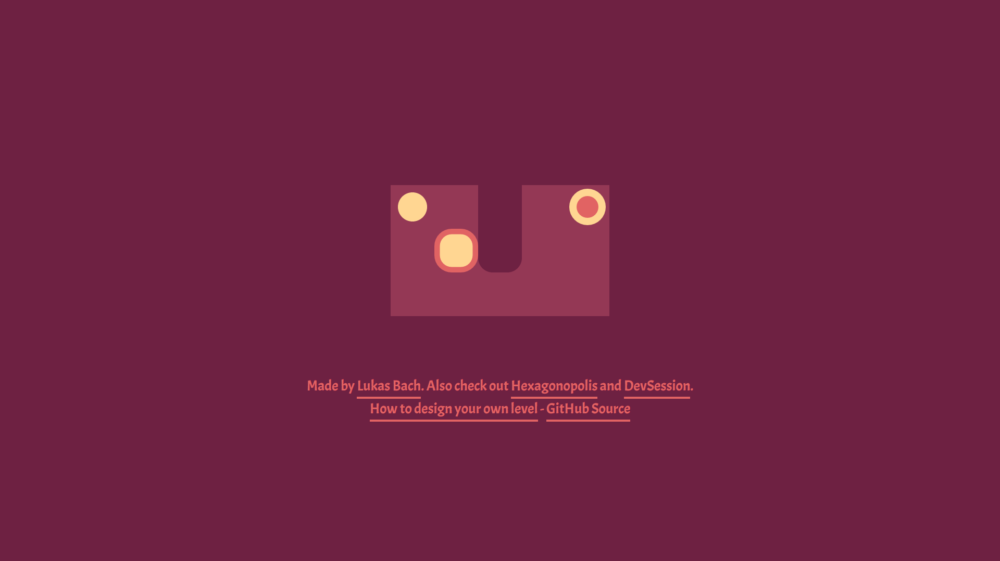
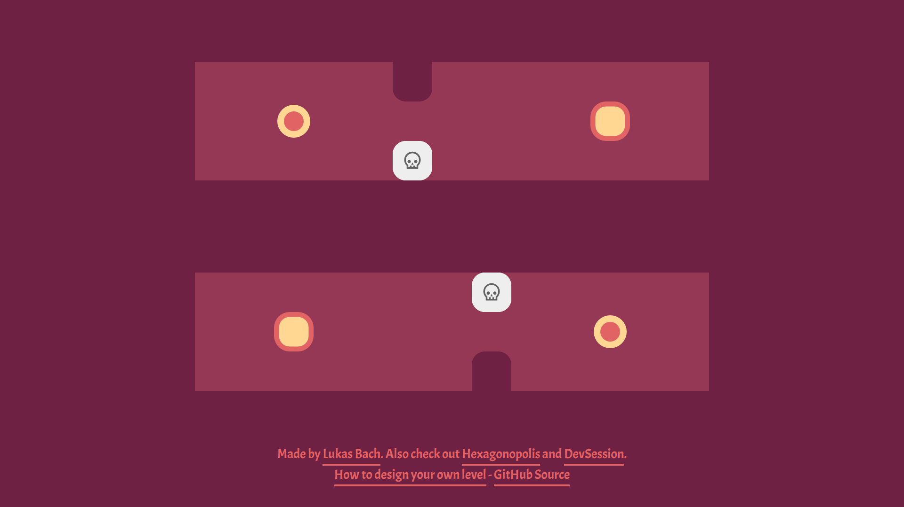
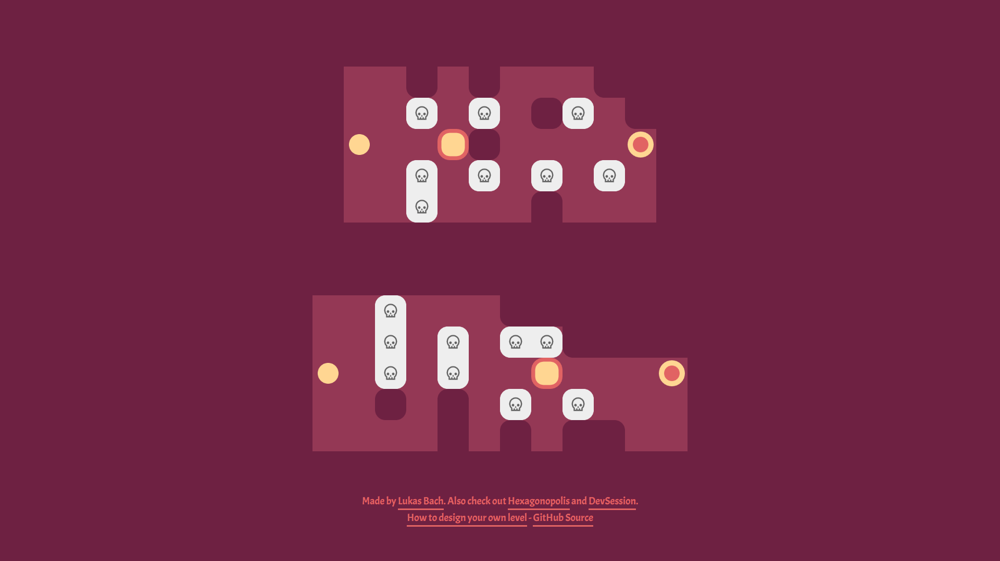

# Slyder

Slyder is a web-based puzzle game based around the idea of mirrored
tile moving playable at 
[lukasbach.github.io/slyder/](https://lukasbach.github.io/slyder/).
It was developed using TypeScript and the Konva library.

There are not a lot of levels to play, but you can define your own
levels as described [here](./level-creation.md).

## Screenshots

## Developing and Deploying

If you want to download and run the game locally, you can
do so by following the usual npm/yarn workflow, ``yarn && yarn start``
to run the game and ``yarn && yarn run build`` to build independent
deployment artifacts.
    